<div align="center">


<br/>


<br/><br/>

**P**ersonalised **Y**ield **R**esearch **O**rchestration **S**ystem

</div>
---
## Description

PYROS is a personal AI desktop companion, built entirely from scratch as a real standalone Windows application rather than a chatbot in a browser tab. She has her own window, her own memory that survives across sessions, her own personality, and a growing set of real capabilities: live news and weather awareness, a fully accurate 3D solar system rendered in real time, a voice she can speak with and hear through, and the beginnings of genuine autonomy - she checks in on her own when the conversation goes quiet, and she can read her own source code and crash logs to explain what went wrong without anyone opening a terminal.

Every part of PYROS was built one deliberate piece at a time: a language model router with automatic provider fallback, a three-tier memory system, a real-time news and weather pipeline with strict anti-hallucination rules, a from-scratch 3D solar system with real astronomical data, and a swappable voice engine architecture that runs on modest hardware today and scales up to studio-quality speech once better hardware is available. Nothing here is a template or a wrapper around someone else's product. It is a working system built file by file, bug by bug, verified at every step.

This repository is both the working application and a record of that build process: a personal AI project designed to keep growing in capability over time, with automation, face recognition, document understanding, and generative media all on the roadmap ahead.

---

## Features

### Core Intelligence

- Multi-provider language model brain spanning Groq, Mistral, Cerebras, and OpenAI, with automatic key rotation whenever a provider hits a rate limit or fails, so a single dead key never stops a conversation
- A three-tier persistent memory system: a permanent, numbered, plain-text archive of every conversation that has ever happened; a small rolling window of recent exchanges that gets fed back into the model for continuity without overwhelming it; and a long-term semantic memory store built on ChromaDB for facts that should be recalled by meaning rather than exact wording
- A deliberately designed personality: warm, cheerful, and professional, calibrated to be concise by default rather than defaulting to long, padded responses the way most assistants do
- Idle self-talk: after a period with no input, PYROS will speak up on her own initiative with a short, natural observation or check-in, rather than sitting passively and waiting
- Self-awareness of her own codebase: she can read her actual source files and her own crash logs on request, and explain what a file does or what went wrong from the real content, not from a guess

### Real-World Grounding

- Live news retrieval through the Currents API with an RSS-feed fallback for resilience, including region- and country-specific filtering so a request like "news from Japan" pulls genuinely filtered results rather than the global feed
- Real current weather conditions for any named city, pulled live from Weatherstack
- Constant awareness of the actual current date, time, and approximate location, so she is never caught giving an answer that assumes she is frozen at a training cutoff
- Strict honesty guardrails: PYROS is explicitly instructed never to invent details about current events, ongoing conflicts, or anything time-sensitive that was not handed to her as real, freshly fetched data in that specific turn of the conversation

### The Solar System

- A fully custom 3D solar system built directly with Three.js and embedded natively inside her application window, not an embedded browser pointed at someone else's site
- Real NASA-sourced texture mapping for Earth, and real equirectangular texture maps for every other planet, so each body rotates correctly and shows genuinely different terrain from every viewing angle, rather than a single photo pasted onto a sphere
- Real relative orbital and rotation physics derived from actual astronomical data: Mercury genuinely completes its orbit faster than every other planet, Venus and Uranus rotate retrograde exactly as they do in reality, and every planet's relative size and orbital distance is proportioned from real figures rather than arbitrary numbers
- Two hundred and eighty-eight individual moons, matching the real published moon counts of Jupiter, Saturn, Uranus, and Neptune, with the major named moons of each planet rendered individually and the remainder generated to fill out the real total
- Full conversational control over the camera: asking to zoom to Saturn, take me to the Moon, or let me float free directly drives the same camera that a mouse would, with the camera automatically tracking whichever body is currently focused as it continues to orbit
- A genuine rock-particle asteroid belt and Saturn ring built from thousands of individually placed points rather than a flat texture, and a real photographic Milky Way skybox surrounding the entire scene

### Voice

- Real speech-to-text via OpenAI's Whisper model, so PYROS can be spoken to directly rather than requiring typed input at all times
- A swappable text-to-speech architecture with three interchangeable engines behind a single configuration setting: edge-tts as a free, cloud-based option that requires no GPU and works immediately on modest hardware; Chatterbox-Turbo and VibeVoice as studio-quality alternatives that require a real GPU, either locally on future hardware or called remotely through a Google Colab-hosted, authenticated API in the meantime
- Fully interruptible speech with a genuine stop control, backed by a persistent audio mixer and careful thread lifecycle management so that background speech can no longer be silently killed mid-sentence

### Engineering Details

- A codebase organized around single-responsibility files: brain.py for language model routing, memory.py for persistence, personality.py for behavioral rules, identity.py for factual data about creator and self, voice.py for speech in and out, news.py and weather.py for live data, and self_awareness.py for introspection, each doing exactly one job and nothing else
- Crash-resistant background threading throughout the application: every background operation catches its own errors, reports them through a proper signal rather than dying silently, and a global exception hook writes any truly uncaught error to a permanent crash log for later diagnosis
- Security-conscious design for anything exposed to the network: remote API calls are authenticated with a shared secret rather than relying on an obscure URL for protection, and all credentials live in a git-ignored .env file that is never committed to the repository

---

## Architecture

PYROS is organized as a set of independent modules that all report into a single application shell. The GUI owns the window and the background threads. The brain owns reasoning and delegates outward to whichever data source a given question actually requires. Memory sits underneath everything, read from and written to on every exchange.

```mermaid
graph TD
    subgraph Application Shell
        A[main.py: GUI, Threads, Globe Panel, News Panel]
    end

    subgraph Reasoning Layer
        B[brain.py: LLM Router and Provider Fallback]
        F[personality.py: Behavioral Rules]
        G[identity.py: Creator and Self Facts]
    end

    subgraph Real World Data
        H[news.py: Live News and Region Filtering]
        I[weather.py: Live Weather]
        J[awareness.py: Date, Time, Location]
        K[self_awareness.py: Own Source Code and Crash Logs]
    end

    subgraph Memory
        E[memory.py: Memory Interface]
        N[(ChromaDB: Long Term Semantic Facts)]
        O[(full_log.txt: Permanent Numbered Archive)]
        P[(chat_history.txt: Rolling Recent Context)]
    end

    subgraph Voice
        C[voice.py: Voice Interface]
        L[Whisper: Speech to Text]
        M1[edge-tts: Default, No GPU]
        M2[Chatterbox-Turbo: Local GPU]
        M3[VibeVoice: Local GPU or Remote Colab API]
    end

    subgraph Visualization
        D[globe.html: Three.js 3D Solar System]
        D1[Real Planet Textures]
        D2[Real Orbital Physics]
        D3[Chat Driven Camera Control]
    end

    A --> B
    A --> C
    A --> D
    B --> F
    B --> G
    B --> H
    B --> I
    B --> J
    B --> K
    B --> E
    E --> N
    E --> O
    E --> P
    C --> L
    C --> M1
    C --> M2
    C --> M3
    D --> D1
    D --> D2
    D --> D3
    A -.chat commands.-> D3
```



Each box above corresponds to a real file in the repository. The brain never talks to the network or the filesystem directly for anything beyond its own reasoning. Instead it asks the appropriate module for real data, injects that data into its own context for a single turn, and is explicitly instructed never to fabricate what a real data source would have returned if a real source was not consulted for that specific question. This separation is what allows individual pieces, such as the news source or the voice engine, to be swapped out without touching the reasoning logic itself.

### How a single message actually flows through the system

When a message is typed or spoken into PYROS, it does not go straight to the language model. It first passes through a series of lightweight detectors inside brain.py that check whether the message is actually a request for something PYROS should look up rather than reason about: a news question, a weather question, a request to zoom the solar system camera, a question about her own code, or a question about a recent crash. If one of those detectors matches, the relevant module is called first, and its real output is injected directly into that single turn's context before the language model ever sees the question. Only after that grounding step does the language model generate a reply, and it is explicitly instructed to treat that injected data as fact rather than a suggestion. This is why PYROS can be asked about today's weather in a specific city and receive a real answer instead of a guess: the guess was never given the opportunity to happen in the first place.

Memory works on a similar principle of separation. Every exchange is written to a permanent, numbered, plain-text archive that is never trimmed and never deleted, so the full history of every conversation always exists on disk. A much smaller rolling window of the most recent exchanges is what actually gets sent to the language model on each turn, which keeps the model's context small and fast without losing the permanent record. Separately again, anything explicitly flagged as worth remembering long-term is stored in a vector database and can be recalled later by meaning rather than exact phrasing, even if it happened weeks earlier and has long since fallen out of the rolling window.

---

## Getting Started

The steps below assume Windows, since that is the platform PYROS has been built and tested on.

Step one is to install Python 3.11. Download it from the official Python website if it is not already installed, and make sure the option to add Python to your system PATH is checked during installation.

Step two is to clone the repository and move into its directory.

```bash
git clone https://github.com/Aashish-Yadav7/PYROS.git
cd PYROS
```

Step three is to create a virtual environment. This keeps PYROS's dependencies fully separate from anything else installed on your system.

```bash
python -m venv venv
```

Step four is to activate that virtual environment.

```bash
venv\Scripts\activate
```

Your terminal prompt should now begin with `(venv)`. If PowerShell blocks this with a script execution error, run the following command once, then try activating again.

```powershell
Set-ExecutionPolicy -ExecutionPolicy RemoteSigned -Scope CurrentUser
```

Step five is to install all required dependencies.

```bash
pip install -r requirements.txt
```

Step six is to obtain your own API keys. PYROS relies on several external services, each with a usable free tier: Groq, Mistral, Cerebras, and OpenAI for the language model itself, the Currents API for live news, and Weatherstack for live weather. Sign up for whichever of these correspond to the features you want to use.

Step seven is to create your environment file. Copy `.env.example` to a new file named `.env` in the project root, then fill in the real values you obtained in the previous step.

```dotenv
GROQ_API_KEY_1=your_key_here
GROQ_API_KEY_2=your_backup_key_here
MISTRAL_API_KEY_1=your_key_here
CEREBRAS_API_KEY_1=your_key_here
OPENAI_API_KEY_1=your_key_here
CURRENTS_API_KEY=your_key_here
WEATHERSTACK_API_KEY=your_key_here
TTS_ENGINE=edge_tts
CREATOR_NAME=Your Name
```

The `.env` file is listed in `.gitignore` and will never be committed, so your personal keys remain private even if this repository is pushed publicly.

Step eight is to launch PYROS for the first time.

```bash
python main.py
```

Step nine is to complete first-run setup. On the very first launch, PYROS will ask for your name and what you would like to be called going forward. This only happens once. The answers are saved locally, and every future launch will skip straight to a normal conversation.

Step ten is simply to begin. Type a message, or use the microphone button to speak directly. Ask about the news, ask about the weather somewhere, or say something like zoom to Jupiter and watch the solar system respond in real time.

---

#
---

## Roadmap

Complete:

- Core brain with multi-provider fallback
- Persistent three-tier memory
- Personality and identity system
- Real-time news, weather, date, time, and location awareness
- Full 3D solar system with real physics and real textures
- Voice input through Whisper and swappable voice output engines
- Self-awareness of source code and crash logs

In progress:

- Background research agent
- Full task automation, including email, messaging, and text editor control

Planned:

- Face recognition
- PDF reading and summarization
- Text-to-image and text-to-video generation

---

<div align="center">

</div>
##  Roadmap

- [x] Core brain with multi-provider fallback
- [x] Persistent memory (archive + semantic recall)
- [x] Personality + identity system
- [x] Real-time news, weather, date/time/location
- [x] 3D solar system with real physics and textures
- [x] Voice input (Whisper) and output (edge-tts / Chatterbox / VibeVoice)
- [x] Self-awareness (reads own code + crash logs)
- [ ] Background research agent
- [ ] Full task automation (email, WhatsApp, Notepad, and beyond)
- [ ] Face recognition
- [ ] PDF reading and summarization
- [ ] Text-to-image and text-to-video generation

---

<div align="center">


</div>
