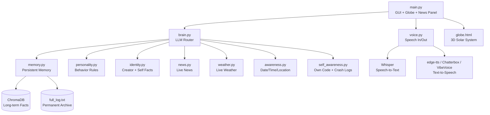

<div align="center">


<br/>


<br/><br/>

**P**ersonalised **Y**ield **R**esearch **O**rchestration **S**ystem

*A personal AI assistant with memory, a voice, a 3D solar system, and a mind of her own.*

</div>

---

##  What is PYROS?

PYROS is a personal AI desktop companion — built from scratch, piece by piece — that remembers you, talks to you, keeps up with real news and weather, and lives inside her own custom window complete with a fully real, textured, rotating 3D solar system in the corner.

She's not a chatbot in a browser tab. She's a standalone Windows application with her own personality, her own memory that persists across sessions, and the beginnings of real autonomy — self-talk when you go quiet, self-awareness of her own source code, and a roadmap toward full task automation.

<div align="center">

</div>

---

##  Features

###  Core Intelligence
- **Multi-provider LLM brain** — Groq, Mistral, Cerebras, OpenAI, with automatic key rotation on rate limits
- **Persistent memory** — numbered, permanent chat archive + a rolling recent-context window + long-term semantic fact storage via ChromaDB
- **Real personality** — warm, cheerful, professional, concise by design — not a chatty robot
- **Self-talk** — speaks up on her own after a few minutes of silence, instead of just waiting
- **Self-awareness** — can read her own source code and crash logs to explain what went wrong, with zero terminal needed

###  Real-World Grounding
- **Live news** — Currents API + RSS fallback, with region/country-specific filtering ("news from Japan")
- **Real weather** — live current conditions for any city via Weatherstack
- **Date, time, and location awareness** — always grounded in the actual present moment
- **Strict honesty rules** — never invents current events or facts she doesn't actually have

###  The Solar System
- Fully custom-built 3D solar system rendered with Three.js, embedded directly in her window
- **Real NASA-based textures** for Earth; real equirectangular maps for every other planet
- **Real orbital & rotation physics** — Mercury genuinely orbits fastest, Venus and Uranus rotate retrograde, exactly like real astronomy
- **288 moons** — matching the real known-moon counts of Jupiter, Saturn, Uranus, and Neptune
- Chat-controlled camera — say *"take me to Saturn"* or *"let me float free"* and watch it happen live
- Real rock-particle asteroid belt and Saturn ring, real Milky Way skybox

###  Voice
- **Speech-to-text** via OpenAI Whisper — talk to her, don't just type
- **Swappable text-to-speech engines** — edge-tts (works today, zero GPU) → Chatterbox-Turbo or VibeVoice (studio-quality, GPU required, remote-callable via Google Colab)
- Fully interruptible — a real Stop button, no more talking over herself

###  Under the Hood
- Clean, single-purpose files — `brain.py`, `memory.py`, `personality.py`, `voice.py`, `news.py`, `weather.py` — each does exactly one job
- Crash-proof threading — background errors get logged and shown, never silently kill the app
- Secure by design — `.env`-based secrets, never committed, authenticated remote API calls

---

##  Architecture



---

##  Getting Started

```bash
git clone https://github.com/Aashish-Yadav7/PYROS.git
cd PYROS
python -m venv venv
venv\Scripts\activate          # Windows
pip install -r requirements.txt
```

Copy `.env.example` to `.env` and fill in your own API keys:

```dotenv
GROQ_API_KEY_1=your_key_here
GROQ_API_KEY_2=your_backup_key_here
CURRENTS_API_KEY=your_key_here
WEATHERSTACK_API_KEY=your_key_here
TTS_ENGINE=edge_tts
CREATOR_NAME=Your Name
```

Then launch her:

```bash
python main.py
```

First run will ask your name and what you'd like to be called — after that, she remembers.

---

##  Screenshots

<div align="center">
<i>Add your own screenshots here — the chat window, the solar system in action, a voice conversation mid-flow.</i>

<br/><br/>


</div>

---

##  Roadmap

- [x] Core brain with multi-provider fallback
- [x] Persistent memory (archive + semantic recall)
- [x] Personality + identity system
- [x] Real-time news, weather, date/time/location
- [x] 3D solar system with real physics and textures
- [x] Voice input (Whisper) and output (edge-tts / Chatterbox / VibeVoice)
- [x] Self-awareness (reads own code + crash logs)
- [ ] Background research agent
- [ ] Full task automation (email, WhatsApp, Notepad, and beyond)
- [ ] Face recognition
- [ ] PDF reading and summarization
- [ ] Text-to-image and text-to-video generation

---

<div align="center">

### Built with persistence, a lot of debugging, and zero shortcuts.


</div>
